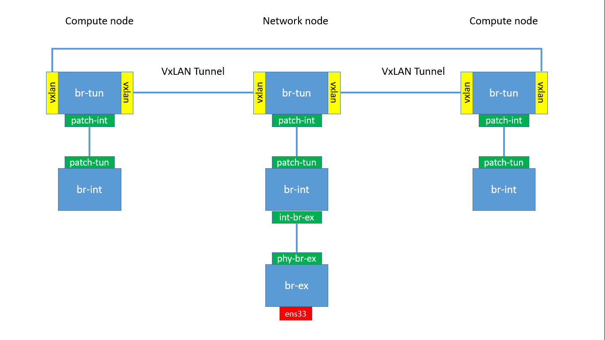
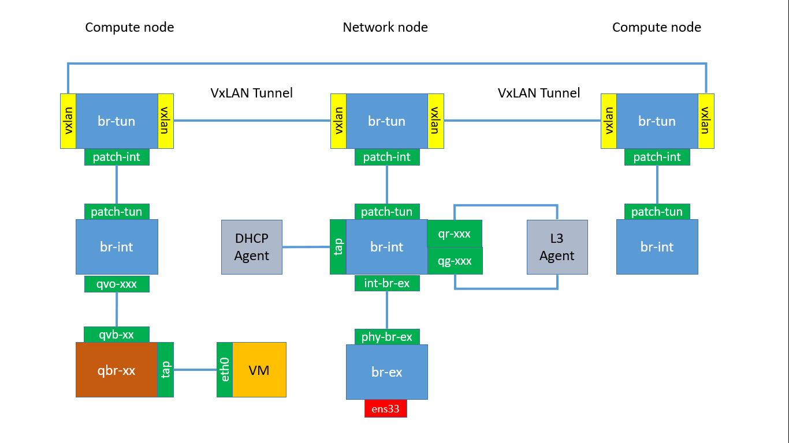
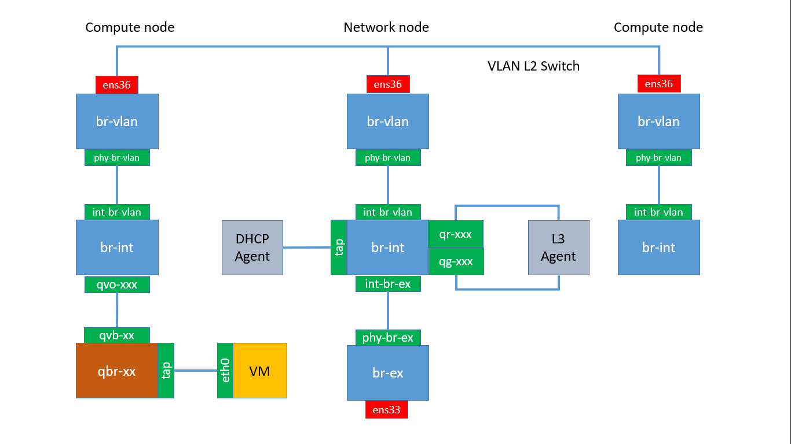
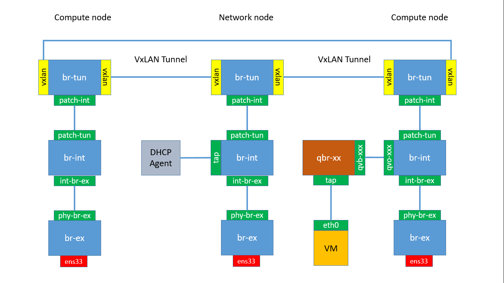

# Open vSwitch Layout
The OpenStack framework is able to use different Software Defined Storage solutions. The default option is the Open vSwitch as per ``/etc/neutron/plugin.ini`` configuration file on the Controller node. The Open vSwitch installed on the Network node and all the Compute nodes is controlled by the Neutron service via the Open vSwitch Neutron Agents wich settings are in configuration file ``/etc/neutron/plugins/ml2/openvswitch_agent.ini``.

On the Controller node
```
# vi /etc/neutron/plugin.ini
[ml2]
# (ListOpt) Ordered list of networking mechanism driver entrypoints
# to be loaded from the neutron.ml2.mechanism_drivers namespace.
# mechanism_drivers = openvswitch
mechanism_drivers = openvswitch
# Example: mechanism_drivers = openvswitch,mlnx
# Example: mechanism_drivers = arista
# Example: mechanism_drivers = openvswitch,cisco_nexus,logger
# Example: mechanism_drivers = openvswitch,brocade
# Example: mechanism_drivers = linuxbridge,brocade
```

On the Network and all Compute nodes
```
# vi /etc/neutron/plugins/ml2/openvswitch_agent.ini
[ovs]
integration_bridge = br-int
tunnel_bridge = br-tun
tunnel_types = vlan, vxlan, gre
bridge_mappings = external:br-ex
...
```

The **Integration Bridge** acts as a virtual "patch bay". On Compute node, all VM virtual interfaces are attached to this bridge and then "patched" according to their network connectivity. On the Network node, all DHCP Server instances and L3 Router, Firewall and Load Balancer are attached to this bridge.

The **Tunnel Bridge** provides the connettivity for the tenant networks between Compute nodes and Compute nodes and Network node. The tunnel type can be VLAN, VxLAN or GRE based, depending on the setup.

Finally, the **External Bridge** provides a mapping between the physical network and the Open vSwitch layout inside both Compute and Network nodes, depending on the setup. In case of Tenant networks only scenario, the Compute nodes are not attached to the external network and the external bridge is not present on the layout. The external bridge is only present on the layout of the Network node. In case of the Provider network scenario, the external bridge will be present also on the Compute nodes since it provides connectivity to the outside via the provider networks.

Making changes to the Open vSwitch Agent configuration requires always the agent restart
```
# systemctl restart neutron-openvswitch-agent
```

#### Layout in Tenant network scenario
We assume a Network node providing access to the outside and two Compute nodes for VMs. Tenant networks connectivity is based on VxLAN tunnels. GRE Tunnel has the same OVS layout with GRE tunnel endpoints instead of VxLAN endpoints.

Starting with an empty layout without VMs. Figure below shows the layout



To check the layout use ``ovs-vsctl show`` command.
```
[root@network]# ovs-vsctl show
d7930874-e155-42d7-978a-f78d0bcb218e
    Bridge br-ex
        Port phy-br-ex
            Interface phy-br-ex
                type: patch
                options: {peer=int-br-ex}
        Port br-ex
            Interface br-ex
                type: internal
        Port "ens33"
            Interface "ens33"
    Bridge br-int
        fail_mode: secure
        Port br-int
            Interface br-int
                type: internal
        Port patch-tun
            Interface patch-tun
                type: patch
                options: {peer=patch-int}
        Port int-br-ex
            Interface int-br-ex
                type: patch
                options: {peer=phy-br-ex}
    Bridge br-tun
        fail_mode: secure
        Port br-tun
            Interface br-tun
                type: internal
        Port "vxlan-c0a80120"
            Interface "vxlan-c0a80120"
                type: vxlan
                options: {df_default="true", in_key=flow, local_ip="192.168.1.38", out_key=flow, remote_ip="192.168.1.32"}
        Port "vxlan-c0a80122"
            Interface "vxlan-c0a80122"
                type: vxlan
                options: {df_default="true", in_key=flow, local_ip="192.168.1.38", out_key=flow, remote_ip="192.168.1.34"}
        Port patch-int
            Interface patch-int
                type: patch
                options: {peer=patch-tun}
    ovs_version: "2.4.0"
```

To list the bridges on the system
```
[root@network ~]# ovs-vsctl list-br
br-ex
br-int
br-tun
```

Check the chain of ports and bridges on the Network node. The bridge ``br-ex`` contains the physical network interface ``ens33`` and the virtual interface ``phy-br-ex`` attached to the ``int-br-ex`` of the ``br-int``
```
[root@network ~]# ovs-vsctl list-ports br-ex
em3
phy-br-em3
```

The integration bridge ``br-int`` is linked to the external bridge via ``int-br-ex`` interface and to the tunnel bridge via ``patch-tun`` interface
```
[root@network ~]# ovs-vsctl list-ports br-int
int-br-ex
patch-tun
```

The tunnel bridge ``br-tun`` is linked to the integration bridge via ``patch-int`` interface and to the VxLAN tunnel. The VxLAN tunnel consists in two separate ``vxlan-c0a80xxx`` interfaces. Remember that the VxLAN tunnel realize a L2 link on top of UDP/IP routed interfaces.

```
[root@network ~]# ovs-vsctl list-ports br-tun
patch-int
vxlan-c0a80120
vxlan-c0a80122
```

Create a network infrastructure for the tenant network scenario and start a VM on the tenant network. The OVS Layout should look like the following picture



The VM is connected to a Lunix Bridge ``qbr-xx`` via a ``tap`` interface;

Bridge ``qbr-xx`` is connected to ``br-int`` using virtual ethernet (veth) pair ``qvb-xx <-> qvo-xxx``.

Interface ``qvb-xx`` is connected to the ``qbr-xx`` linux bridge, and ``qvo-xx`` is connected to the ``br-int`` Open vSwitch (OVS) bridge. The Linux bridge configuration can be inspected on Compute node by
```
[root@compute ~]# brctl show
bridge name     bridge id               STP enabled     interfaces
qbrbfee0484-ec          8000.e263d973999f       no      qvbbfee0484-ec
                                                        tapbfee0484-ec
```

The ``br-int`` Open vSwitch bridge on the Compute node is configured as
```
[root@compute ~]# ovs-vsctl show
Bridge br-int
        fail_mode: secure
        Port br-int
            Interface br-int
                type: internal
        Port int-br-ex
            Interface int-br-ex
                type: patch
                options: {peer=phy-br-ex}
        Port patch-tun
            Interface patch-tun
                type: patch
                options: {peer=patch-int}
        Port "qvo76e136f0-5c"
            tag: 4
            Interface "qvo76e136f0-5c"
    ovs_version: "2.4.0"
```

The packet is then moved to the ``br-tun`` OVS bridge using the patch-peer ``patch-tun <-> patch-int``. When the packet reaches the tunnel bridge, it is tagged with the appropriate VxLAN tag, and then sent over the VxLAN Tunnel.

When the packet reaches its destination on the Network node via VxLAN tunnel, it is passed to the tunnel bridge ``br-tun`` and then passed to the integration bridge using the pair ``patch-int <-> patch-tun``. The ``br-int`` Open vSwitch bridge on the Network node is configured as
```
[root@network ~]# ovs-vsctl show
    Bridge br-int
        fail_mode: secure
        Port br-int
            Interface br-int
                type: internal
        Port "qr-c040e20e-25"
            tag: 1
            Interface "qr-c040e20e-25"
                type: internal
        Port patch-tun
            Interface patch-tun
                type: patch
                options: {peer=patch-int}
        Port "tap2cda547c-d2"
            tag: 1
            Interface "tap2cda547c-d2"
                type: internal
        Port int-br-ex
            Interface int-br-ex
                type: patch
                options: {peer=phy-br-ex}
        Port "qg-7587486d-c3"
            tag: 2
            Interface "qg-7587486d-c3"
                type: internal
```

There are additional interfaces in the integration bridge:

1. The ``tap`` interface connecting the ``br-int`` to the DHCP Agent.
2. The ``qr-xxx`` interface connecting to the tenant port of the L3 Agent.
3. The ``qg-xxx`` interface connecting to the external port of the L3 Agent.

The packet reaching the integration bridge is then moved to the L3 Agent for routing. If the packet is destined to the external network, it is moved to the external bridge ``br-ex`` and finally, it reaches the physical external network via the NIC interface ``ens33``. The external bridge on the Network node is configured as
```
[root@network ~]# ovs-vsctl show
d7930874-e155-42d7-978a-f78d0bcb218e
    Bridge br-ex
        Port "ens33"
            Interface "ens33"
        Port phy-br-ex
            Interface phy-br-ex
                type: patch
                options: {peer=int-br-ex}
        Port br-ex
            Interface br-ex
                type: internal
```

Start a second VM making sure the new VM is started on the second Compute node (this can be achieved in many ways, forcing the avalibility zone, see [Cloud Scaling](https://github.com/kalise/OpenStack-Tutorial/blob/master/Content/scale.md)).

```
# source keystonerc_demo
# nova boot second_instance \
--flavor small \
--image cirros  \
--key_name demokey \
--security-groups default \
--nic net-id=<internal_network_id>
```

The OVS Layout should look like the following picture


Packet flow between the two VMs will happen between the two Compute nodes without passing through the Network node.

#### Layout in Tenant VLAN scenario
The OVS Layout in Tenant networks scenario is similar when using a tunneled tecnology like VxLAN or GRE encapsulation. In this section, we are going to check the layout when using VLAN based tenant networks. All the Compute and the Nework nodes have a dedicated physical interface attached to the VLAN L2 switch. This interface can be different from the physical interface used for the external network. The external network is flat or VLAN based.

In our case, we are going to use two separate physical interfaces:

* On Network node: ``ens33`` interface for a flat external network mapped on the ``br-ex`` bridge and ``ens36`` interface for the VLAN based tenant networks mapped on the ``br-vla``n bridge.
* On all Compute nodes: ``ens36`` for the VLAN based tenant networks mapped on the ``br-vlan`` bridge.

Create the network infrastructure as per Tenant VLAN scenario and start a VM on the tenant network. The OVS Layout should look like the following picture




#### Layout in Provider networks scenario
In the Tenant networks scenario, the traffic from/to the external network passes through the Network node, so the Compute nodes do not need to have access to the external network. In the Provider networks scenario, the Compute nodes are directly attached to the external physical network.

Configure the setup as in [Provider Network Scenario](https://github.com/kalise/OpenStack-Tutorial/blob/master/Content/provider-network.md) and start a VM on the provider network

The Open vSwitch layout will be like in the following picture



Unlike the tenant networks scenario, the integration bridge of Compute nodes is linked to the external bridge via ``int-br-ex`` interface. The external bridge ``br-ex`` is linked to the external physical network via the ``ens36`` NIC card. The integration bridge is still linked to the tunnel bridge ``br-tun``. This is still required when the VM starts in order to get the IP address from the DHCP Agent. Create the network infrastructure as per Provider network scenario and start a VM. 


Check the OVS layout
```
[root@compute ~]# ovs-vsctl list-ports br-int
int-br-ex
patch-tun
qvo498a4343-33

[root@compute0 ~]# ovs-vsctl list-ports br-ex
ens36
phy-br-ex

[root@compute0 ~]# ovs-vsctl list-ports br-tun
patch-int
vxlan-c0a80121
vxlan-c0a80123
```
